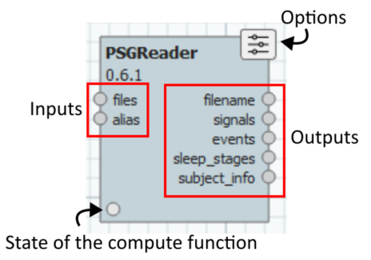
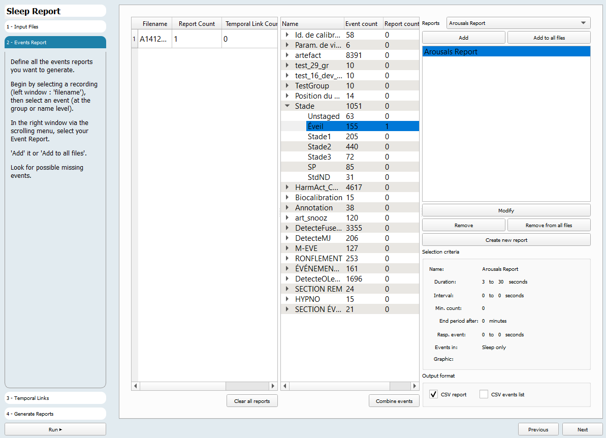
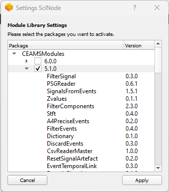

# Copyright
Copyright (c) 2023-2025, Valorisation Recherche HSCM, Societe en Commandite

# License
GPL-3.0 license

# Snooz developer guide
## What is this?

Snooz is an analysis platform for sleep studies recordings (Polysomnography). It is a highly flexible and extensible software. However, this flexibility comes with the trade-off of increased complexity for software developers tasked with creating new features. The purpose of this documentation is to assist you in installing and setting up the development environment.

For developer installation instructions, please refer to the Developer Installation Guide in the documentation : https://snooz-toolbox-documentation.readthedocs.io/dev_guide/installation/installation.html

First, let's take a moment to understand how and why it functions the way it does.

## Table of Contents
- [Technical overview](#technical-overview)
- [Installation](#installing-ide)
- [Configuration](#ide-configuration)
- [What's next?](#whats-next)

## Technical overview
### Modules

At the core of our software are modules. A module is a self-contained unit designed to execute a distinct task. Developers create modules to address specific aspects, such as reading a PSG file, running a feature detection algorithm over a signal, or generating a report based on events within the signals, etc. A module consists of three parts: the inputs, the compute function, and the outputs.

### Processes
By linking the outputs of one module to the inputs of another, a process is formed. For instance, we might create a process that enables us to select a file, extract its signals, filter the signal, and subsequently write the filtered signal back into the file. These processes are stored within a JSON file, which outlines the modules utilized and their interconnections. Sharing a new process is as simple as sharing the corresponding JSON file, provided that your collaborator has the same modules installed (more details on that will be discussed later).

### Tools
Processes can become highly intricate, involving dozens of modules and parameters. One of the objectives with Snooz was to enable expert technicians, who may not be developers, to use and configure these processes in a user-friendly manner. To achieve this, we introduced tools. A tool serves as an abstraction layer over a process, featuring a step-by-step interface. This interface guides the user through a series of steps, explaining and exposing the pertinent parameters of the process.

### Package and versioning
A challenge with a system like this is that when changes are made to a module, it has the potential to disrupt all processes and tools that depend on it. This poses issues on multiple fronts. Firstly, it complicates the reproduction of past analyses. Secondly, any modification to a module results in a cascade of adjustments needed for all tools utilizing it.

To address this challenge, we implement a concept of versioning and packages. Each module is assigned a specific version, and all modules are encapsulated within a package. When creating a process, the versions of the modules used are recorded. Upon reloading that process, Snooz identifies the corresponding package containing that module version and loads it into memory. This ensures that improvements made to the module over time do not jeopardize the functionality of previous tools.

Each tool also possesses a version and is contained within a package. In Snooz, the process of adding a new tool consists of importing a new package. This way, you can develop a new process with a step-by-step interface and new modules. Then, you only need to send your package to a colleague for them to start using it by importing it into Snooz.

By default, when you install Snooz, it is preloaded with several packages developed by the software team at CEAMS. The intention is to build an ecosystem over time that includes modules, processes, and tools developed by various teams and collaborators.

## Installing your development environment
This section will guide you through the steps of installing and configuring your development environment.

### First, you need an IDE
We use Visual Studio Code as our Integrated Development Environment (IDE). It's a free tool developed by Microsoft and is compatible with multiple platforms, including Windows, Linux, and macOS.
For installation instructions, please refer to the following link: https://code.visualstudio.com/download.

### Then you need Python 3.10.11
It's important to install Python version 3.10.X. The latest available version with an installer is version 3.10.11.
You can download Python from the following link: https://www.python.org/downloads/release/python-31011/.

> On Windows, it's advised to add the path to the Python executable to your environment variables. Follow this guide: https://realpython.com/add-python-to-path/  
> On windows, the default path is C:\Users\UserName\AppData\Local\Programs\Python\
> On macOS, the default path is /usr/local/bin/python3.10

### Install a Git client
On windows you can use Git for windows: https://git-scm.com/download/win  
On Linux and Mac, run this command:

`sudo apt install git`

### Install the code
First, manually create a folder called "snooz_workspace". This will be the root directory of the project and will contain the subfolders for the code repositories and the Visual Studio Code workspace file.  
-> snooz_workspace (to create manually)  
&nbsp;&nbsp;&nbsp;-> snooz-toolbox (will be created by the git clone command)  
&nbsp;&nbsp;&nbsp;-> snooz_package_template (will be created by the git clone command and renamed for you)  
&nbsp;&nbsp;&nbsp;-> snooz_package_ceams (will be created by the git clone command)  

### The Snooz Toolbox repository
The first repository contains the main application code, which is essential for running the application in debug mode. However, you generally won't need to make modifications to this code unless you are working on a core feature of Snooz rather than on a specific tool.

Clone this repository into your new "snooz_workspace" folder.

`git clone https://github.com/SnoozToolbox/snooz-toolbox.git`

It is advised to tell Git to ignore the file **snooz.code-workspace** once downloaded because it will end up containing values that are specific to your installation. Run this command to do it:

`git update-index --skip-worktree ./snooz.code-workspace`

### Create a Python virtual environment
Software using Python often relies on various external libraries. Some software may require specific versions of these libraries, so it's strongly advised to create a Python virtual environment dedicated to your Snooz installation.

You can follow this guide to set up a Python virtual environment: [Python venv](https://docs.python.org/3/library/venv.html).   
Call it `snooz_310_env`.  
example for windows) `C:\Users\UserName\AppData\Local\Programs\Python\Python310\python -m venv .\snooz_310_env`  

> On Linux, you might need to run this command first: `sudo apt install python3.10-venv`.

> If you have multiple versions of Python installed, make sure you use Python 3.10 to create the virtual environment. You can use the command `python --version` to check which version you are currently using.

### Install QtTools (Linux only)
On Linux, you need to manually install the Qt dev tools to access the designer tool.

`sudo apt-get install qttools5-dev`

### Install the python extension to Visual Studio Code
Visual Studio Code is used for all kinds of programming tasks. To work with Python, you need to install a few extensions.

- Open Visual Studio Code
- From the navigation bar on the left, navigate to the extension panel(Ctrl-Shift-X).
- Install "Python" extension from Microsoft.
- Install Qt for Python

## IDE configuration
Great, we have the code, the IDE, and Python. Now, we need to configure Visual Studio Code.

### Select your python intepreter
You need to tell Visual Studio Code which python intepreter to use.
- Open Visual Studio Code
- **File->Open** workspace from file
- Choose the file **snooz.code-workspace** from the root folder of the Snooz repository.
- Open the **Command Palette** (Ctrl-Shift-p)
- Select **Python:Select Interpreter**
- Select **Select at workspace level**
- Find and select the Python executable within the folder of the Python virtual environment you created in the previous step.

> On MacOS, you may need to add the path to python in the settings (when you virtual env does not appear in the selection.)
>- Open Visual Studio Code
>- Open .vscode/settings.json
>- Add the following setting:
{
    "python.defaultInterpreterPath": "/path_to_virtual_environment/virtual_env/snooz_310_env/bin/python"
}

### Install the external python libraries
We are almost done, we just need to install all the required external librairies.

- Open Visual Studio Code
- Open the **Command Palette** (Ctrl-Shift-p)
- Select **Python:Create terminal**
  
This will open a new terminal at the bottom of Visual Studio Code. Ensure that you see the name of your Python virtual environment in parentheses at the beginning of the line. If not, you need to select the Python interpreter, as explained in the previous step.

> On windows, you may need to change the default terminal profile to use "Command prompt".
>- Open Visual Studio Code
>- Open the **Command Palette** (Ctrl-Shift-p)
>- Select **Command Prompt**

#### To activate the virtual
In the terminal, type:  
- for Windows  
`call path_to_\snooz_310_env\Scripts\activate.bat`  
- for linux/macOS  
`source path_to_/snooz_310_env/bin/activate`  

#### To install all needed libraries
In the terminal, type:  
`pip install -r requirements.txt`

### Run Snooz
Press F5 to run Snooz. If everything is properly set up, the application should start. Congratulations, you are now ready to start doing some development!

## What's next?
Add a custom development package to Snooz and create new modules and tools.

### Setup your work repository for your Modules and Tools package
At this point you can launch and debug Snooz but this is not where your actual work will usually take place. 
You need to create another repository with your own modules and packages and link Snooz to them.

* Fork the "snooz_package_template" repository
	go to : https://github.com/SnoozToolbox/snooz-package-template.git  
	click on the "Fork" and fork this repository   
	You can rename the repository   
* Clone your forked "snooz_package_template" repository in your "snooz_workspace" folder.
* Read the README.md in this repository to know how to use it. In short you will:  
	* Create an empty package.   
	* Add your first module.  
	* Add your first step-by-step tool.  

For instructions on running Snooz from the source code, please refer to the documentation: https://snooz-toolbox-documentation.readthedocs.io/dev_guide/run_snooz.html

To explore the examples in the "snooz_package_template" repository, please refer to the documentation: https://snooz-toolbox-documentation.readthedocs.io/dev_guide/explore_ex.html
